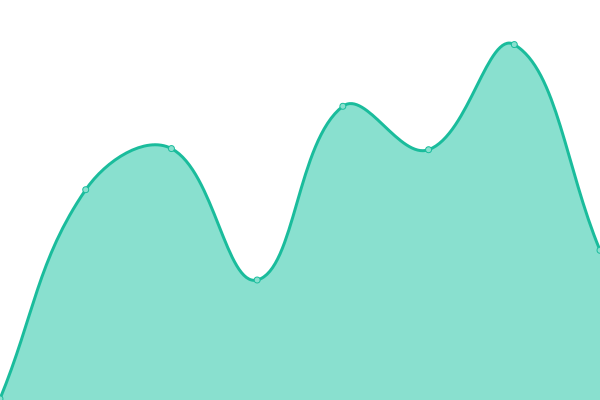

# [📈 Live Status](https://demo.upptime.js.org): <!--live status--> **🟩 All systems operational**

This repository contains the open-source uptime monitor and status page for [Upptime](https://upptime.js.org), powered by [Upptime](https://github.com/upptime/upptime).

With [Upptime](https://upptime.js.org), you can get your own unlimited and free uptime monitor and status page, powered entirely by a GitHub repository. We use [Issues](https://github.com/upptime/upptime/issues) as incident reports, [Actions](https://github.com/staubi82/Upptime/actions) as uptime monitors, and [Pages](https://demo.upptime.js.org) for the status page.

<!--start: status pages-->
<!-- This summary is generated by Upptime (https://github.com/upptime/upptime) -->
<!-- Do not edit this manually, your changes will be overwritten -->
<!-- prettier-ignore -->
| URL | Status | History | Response Time | Uptime |
| --- | ------ | ------- | ------------- | ------ |
|  [OeffWetter.de](https://Oeffwetter.de) | 🟩 Up | [oeff-wetter-de.yml](https://github.com/staubi82/Upptime/commits/HEAD/history/oeff-wetter-de.yml) | 

 739ms
     
 | 

<a href="https:///Upptime/history/oeff-wetter-de">100.00%</a>
    

|  [Staubile.de](https://staubile.de) | 🟩 Up | [staubile-de.yml](https://github.com/staubi82/Upptime/commits/HEAD/history/staubile-de.yml) | 

 3696ms
     
 | 

<a href="https:///Upptime/history/staubile-de">100.00%</a>
    

|  [Github Staubi82](https://github.com/staubi82/) | 🟩 Up | [github-staubi82.yml](https://github.com/staubi82/Upptime/commits/HEAD/history/github-staubi82.yml) | 

 329ms
     
 | 

<a href="https:///Upptime/history/github-staubi82">100.00%</a>
    

|  [Printables](https://www.printables.com/de/@Staubi) | 🟩 Up | [printables.yml](https://github.com/staubi82/Upptime/commits/HEAD/history/printables.yml) | 

 546ms
     
 | 

<a href="https:///Upptime/history/printables">100.00%</a>
    

|  [Google](https://www.google.de) | 🟩 Up | [google.yml](https://github.com/staubi82/Upptime/commits/HEAD/history/google.yml) | 

 208ms
     
 | 

<a href="https:///Upptime/history/google">100.00%</a>
    

|  [Cloudflair DNS](https://one.one.one.one/) | 🟩 Up | [cloudflair-dns.yml](https://github.com/staubi82/Upptime/commits/HEAD/history/cloudflair-dns.yml) | 

 96ms
     
 | 

<a href="https:///Upptime/history/cloudflair-dns">100.00%</a>
    

<!--end: status pages-->

[**Visit our status website →**](https://demo.upptime.js.org)

## 📄 License

- Powered by: [Upptime](https://github.com/upptime/upptime)
- Code: [MIT](./LICENSE) © [Anand Chowdhary](https://anandchowdhary.com), supported by [Pabio](https://pabio.com)
- Data in the `./history` directory: [Open Database License](https://opendatacommons.org/licenses/odbl/1-0/)
